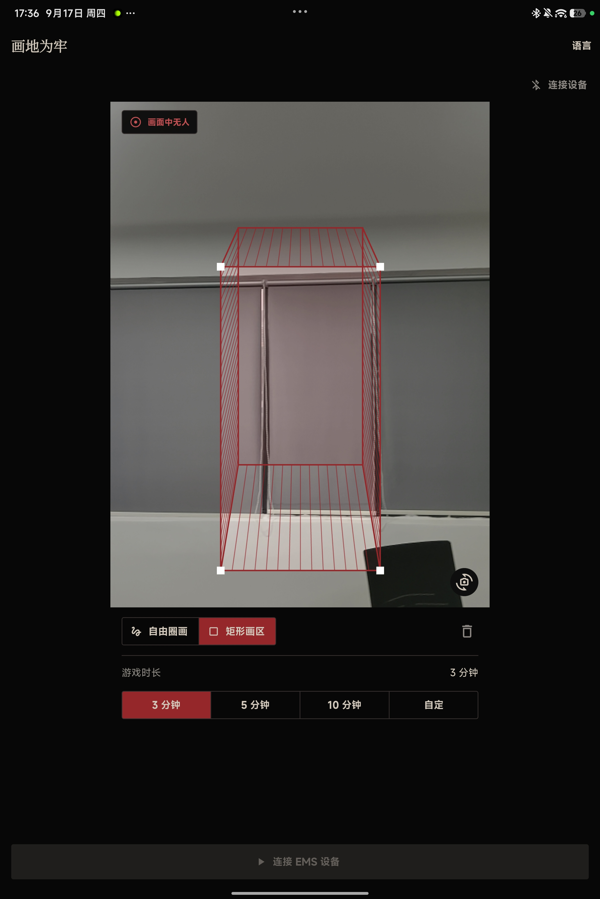

# 役次元 · 画地为牢

**好玩的创意，欢迎一起用。**

这是役次元的单人人体边界挑战游戏。玩家通过手机摄像头画出活动区域，在规定时间内保持身体关节不越界；持续越界或离开画面后，游戏会记录触发事件，并可通过蓝牙连接 EMS 设备输出预设波形。

我们把它开源，让玩家、开发者和同行都能拿去研究、修改，共同创造“自信自爱，方得自由”的役次元社区。

## 玩法

### 画地为牢 · 单人边界挑战

固定手机并确保全身进入画面，使用圈画或矩形工具划定活动区域。游戏开始后，应用会实时识别人体骨骼，并判断肩、肘、腕、髋、膝、踝等关节是否仍在区域内。

玩家可以设置游戏时长、异常持续时间和重复触发间隔。连接兼容的 EMS 设备后，还可以选择设备代际、输出通道、波形和强度。

  

## 使用流程

1. 授予摄像头权限，固定手机，确保全身进入画面。
2. 选择圈画或矩形，画出活动区域。矩形可拖动四角调整，切换摄像头后需要重新画区。
3. 设置游戏时长、异常持续时间和重复触发间隔。
4. 在 EMS 设备页选择设备代际、通道、波形和强度，并连接设备。
5. 确认电极片已正确接入后开始游戏。
6. 游戏结束后查看本局触发记录，或直接再来一局。

默认游戏时长为 5 分钟，异常持续时间为 3 秒，重复触发间隔为 3 秒。游戏时长支持小数分钟，其余时间使用整数秒。

## 判断规则

- 左右肩、肘、腕、髋、膝、踝共 12 个关节参与判断，可信度阈值为 `0.6`，边界上的关节视为区域内。
- 任一可信关节越界，或持续识别不到人，都会开始连续异常计时；两种异常状态互相切换时不会清零。
- 达到异常持续时间后首次触发，异常继续时按照重复触发间隔再次触发。
- 完整识别到人体回到区域内后，异常计时清零。
- 识别到人体但关节不完整，且没有可信越界点时，游戏自动暂停；完整归位后可手动继续。
- 手动暂停、应用进入后台、摄像头故障时，异常计时清零，暂停时间不计入游戏时长。
- 识别流超过 1.5 秒没有新结果时，视为识别中断并暂停游戏。
- 游戏结束优先于同一时刻的设备触发，程序卡顿后不会集中补发触发事件。
- 参数和区域保存在本机，区域与当前摄像头绑定；触发记录仅保留当前一局。

## 好玩的点子，值得有更多版本

画地为牢从一个想法变成了可以玩的游戏，现在，我们把代码也一起分享出来。

喜欢这个玩法，欢迎直接拿去用；有自己的想法，欢迎在它的基础上继续改。玩家、开发者、同行，都可以从这里开始。

**这份玩法，大家尽管用。役次元继续琢磨下一份心动。**

## 免费开源，允许商用，友商也欢迎

本项目采用 [MIT 许可证](https://opensource.org/license/mit)。简单说，你可以：

- 免费使用、复制和分享本项目。
- 修改代码，做成自己的版本。
- 用在商业产品、收费项目或线下经营活动中。
- 作为友商，把代码用进自己的产品，无需另行向我们申请授权。

## KTV、酒吧需要？可以免费聊聊

如果你经营 KTV、酒吧，想把画地为牢用在店里，欢迎联系我们，我们可以提供免费的咨询服务。

## 开始体验

游戏体验或下载：https://github.com/YCY-YOKONEX/Yokonex-Safety-Margin/releases

欢迎来玩，也欢迎拿去做出更好玩的版本。
